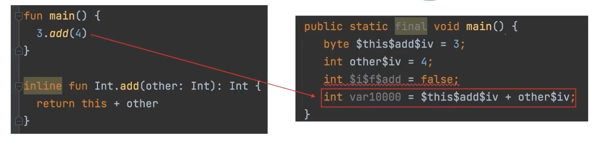

# inline 함수란?
- inline 함수는 함수를 호출하는 곳에 함수의 내용을 복사해 넣어서 호출하는 방식이다.

- 실제 코드를 바이트 코드에서 확인해보면 inline 함수를 사용하면 해당 함수가 바이트코드로 생성되서 호출하는 방식이아니라
함수를 호출하는 부분에 함수의 내용이 복사되어 호출되는 것을 확인할 수 있다.

- 주의 할점으로는 inline 함수를 사용하면 함수의 내용이 복사되어 호출되기 때문에 함수를 부를때 오버헤드는 줄어들긴 하지만 꼭 성능 측정후에 사용하는것을 권장한다

예시

> 출처 : 자바 개발자를 위한 코틀린입문