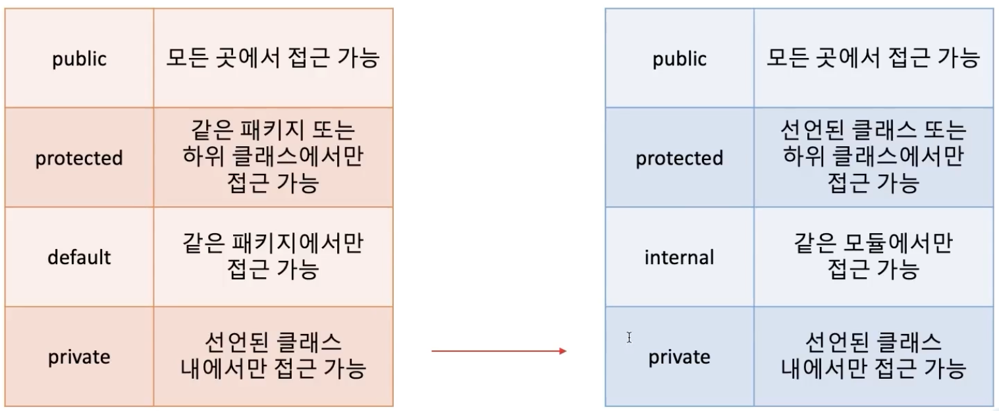

- java - kotlin 접근제어자 차이

- kotlin file
- public은 어디든지 사용가능
- protected kt 파일에서는 사용 불가능하다

- java와 kotlin을 함께 사용할때 주의 할 점

- kotlin의 internal은 바이트 코드상 public으로 변환되기 때문에 java 코드에서는 kotlin 모듈의 internal 코드를 사용이 가능하다
- 마찬가지로 kotlin의 protected는 선언된 클래스나 하위클래스에만 접근이 가능하지만 java의 경우는 같은 패키지 내에서도 접근이 가능 하기 때문에 바이트코드로 변환되면
같은 클래스, 하위클래스가 아니더라도 같은 패키지에 있으면 java 코드는 kotlin의 protected에 접근이 가능하다